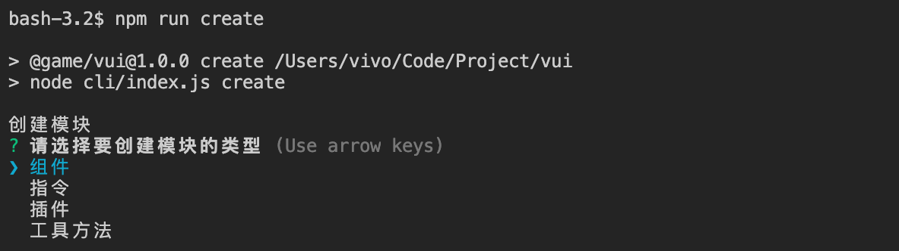

# 开发指南

## 创建模块

```bash
npm run create
```



执行命令自动创建模块后，会自动更新 demo、文档等配置文件，开发者只需要编写对应模块的代码、demo 和文档，代码采用`ts`进行编写。

## 删除模块

```bash
npm run delete
```


## 预览 demo

```bash
cd demo
npm run serve
```

进入到 demo 目录下执行`npm run serve`命令就可以实时预览 demo 效果，开发者修改模块 demo 目录下的代码会实时同步预览，也方便用来进行开发预览。

## 预览文档

```bash
npm run docs:dev
```

开发者创建模块后，可以编辑对应目录下的`README.md`，文档预览会实时同步

## 构建

```bash
npm run build
```

代码构建会生成`es`和`umd`两种风格的代码，`es`代码存放在`lib`目录中，`umd`代码存放在`dist`目录中。

## 提交代码

> 该代码仓库使用了[eslint](https://eslint.org)和[stylelint](https://stylelint.io/)对代码进行校验，同时也使用了[commitlint](https://github.com/conventional-changelog/commitlint)来确保提交信息符合[conventional commit format](https://www.conventionalcommits.org/en/v1.0.0/)，如果任何一个环节校验出错都会导致提交失败。

执行`git commit`时会自动进行`eslint`、`stylelint`校验，同时也会辅助生成规范化的提交信息，如下


## 分支管理

- `dev_2.x`分支为开发分支，用户需要从`dev_2.x`拉出自己的开发分支，开发完成后提交到自己的开发分支并推送到`gitlab`仓库，然后发起合并到`dev_2.x`分支的`merge request`
- `2.x`分支为生产环境分支，当能够发布新版本时，维护者会将`dev_2.x`合并到`2.x`分支。借助 gitlab 的 ci/cd 和 webhook 功能，合并到`2.x`分支时可以实现自动打 tag、发布到 npm 以及更新文档网站的功能
